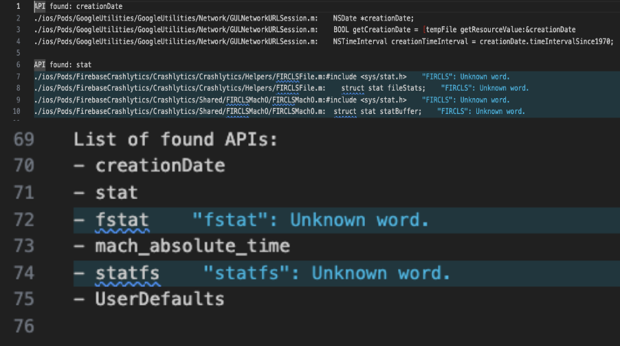
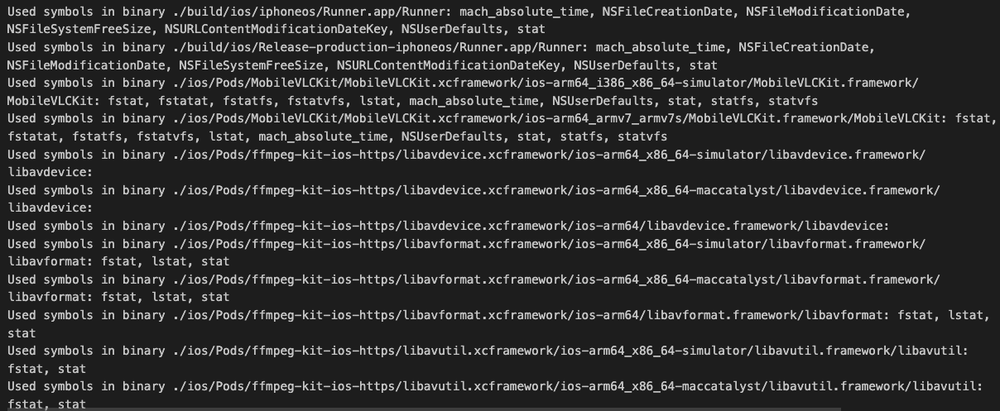
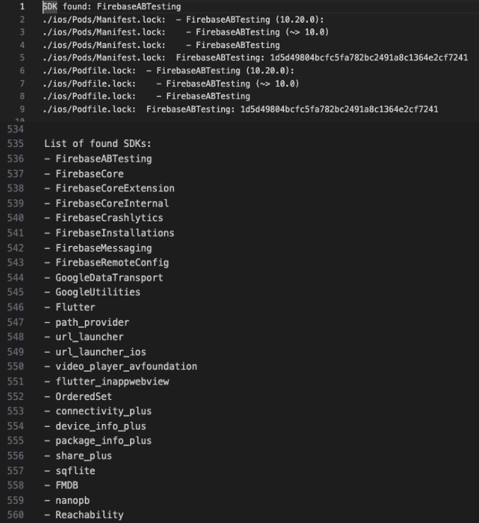

# Scanners for possible use of "iOS required reason API, SDK".

## Required reason api scanner

### Text-based scanner

The scan is very rudimentary and based on comparing strings, but should be very helpful for a first analysis.
See https://developer.apple.com/documentation/bundleresources/privacy_manifest_files/describing_use_of_required_reason_api for details.

- Usage:
  - `pod install --repo-update`
  - `build ios`
  - `sh required_reason_api_text_scanner.sh {directory_name} > find_api_text_results.txt` in root project.
- Example Output:
  > 

### Binary-based scanner

This scanner looks for symbols in the binaries in build folder using nm.

It will find the `.app`, `.framework` and `.a` binaries. Keep in mind that the symbols found in the app (`.app`) will be duplicated from the ones found in the static libraries `.a` since they are statically linked.

- Usage:
  - `pod install --repo-update`
  - Run build ios
  - `sh required_reason_api_binary_scanner.sh {directory_name} > find_api_binary_results.txt` in root project.
- Example Output:
  > 

## Required sdk scanner

### Text-based scanner

The scan is very rudimentary and based on comparing strings, but should be very helpful for a first analysis.
See https://developer.apple.com/support/third-party-SDK-requirements for details.

- Usage:
  - `pod install --repo-update`
  - Run build ios
  - `sh required_sdk_text_scanner.sh {directory_name} > find_sdk_text_results.txt` in root project.
- Example Output:
  > 

### Apple sdk privacy update checker

This script helps quickly check whether the list of third-party SDK requirements on the Apple website has been updated. Because this list may be updated by Apple without clear notification.
See https://developer.apple.com/support/third-party-SDK-requirements for details.

- Usage:
  - Install python3
  - Install library [selenium](https://pypi.org/project/selenium/), [webdriver_manager](https://pypi.org/project/webdriver-manager/)
  - Run build ios
  - `python3 apple_sdk_privacy_update_checker.py` and wait for the result.
- Example Output:
  > 
